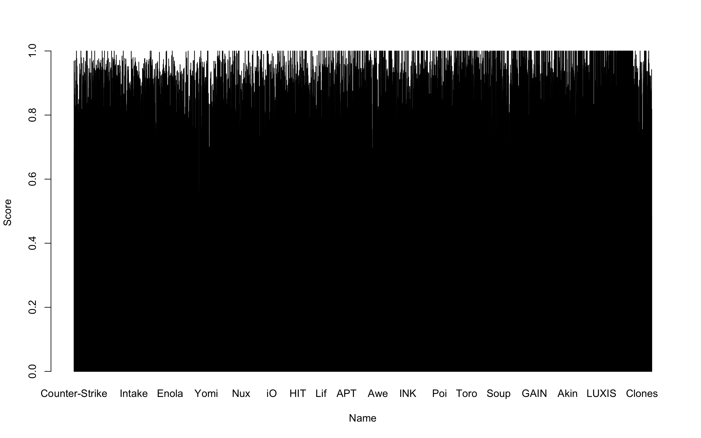
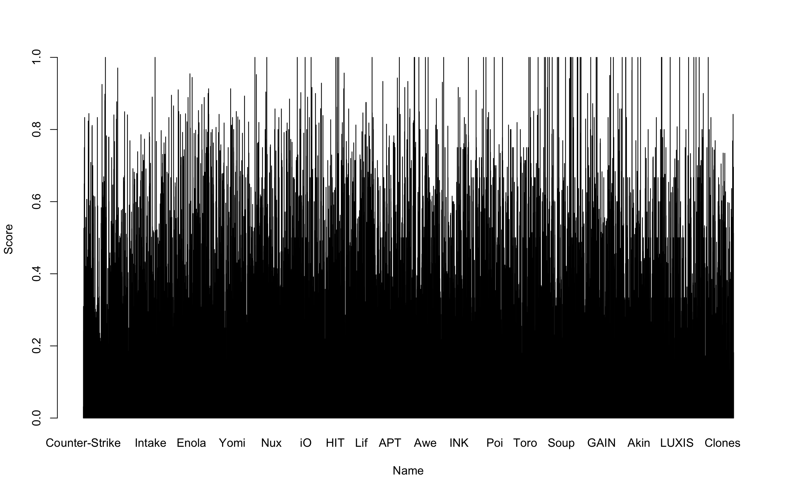

```{r setup, include=FALSE}
knitr::opts_chunk$set(echo = TRUE)
```




## Introduction

My charts was generated by the dataset collected from [Kaggle](https://www.kaggle.com/datasets/andrewmvd/steam-reviews) which displays the relationship between users and games. They provide an idea on whether certain game is recommended by users. 


## Questions

Below are the questions solved by charts:\
1. How popular is the game now and in the future?\
2. Do players recommend this game?\


## Analysis

According to charts, we could understand which game is recommended by users and which is not. We have to look specifically to certain game in order to get the score. For example, if we run the percentage_of_1 function (percentage of people recommend this game) in Chart 3. R for the game Counter-Strike, we could get a number with 96.86% of users would recommend this game. This number will also represent itself with a high bar in the bar chart Data3chart for value 1. If we run the percentage_of_neg_one function (percentage of people who do not recommend this game), we would get another number and this number would represents itself with a low bar in the bar chart Data3chart for score value -1.\
We could used the data above that we generated to get an idea on how popular this game is now. We could also make a personal prediction to see if this game would still be popular in the future.

## Conclusion

We have solved both problems mentioned above by providing 2 charts which could compare the recommended rate of each game. Since the data is very large, it is not very obvious even when directly looking at the chart. We would have to run the percentage function to get the exact data. In order to make the data more visualized, we might have to pick some popular games out and focus on them sepcifically.
