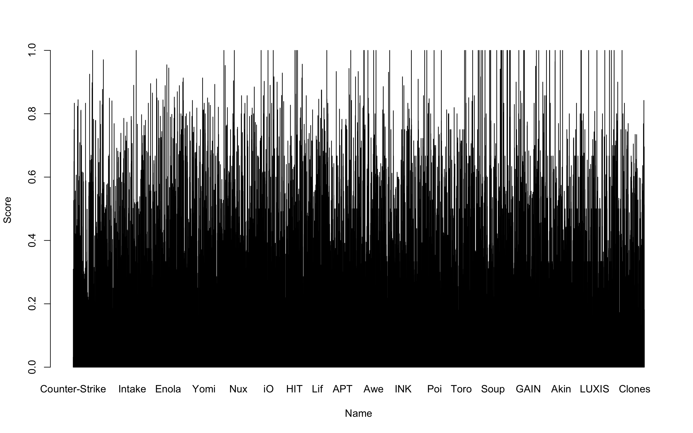

```{r setup, include=FALSE}
knitr::opts_chunk$set(echo = TRUE)
```


##Introduction
Steam is the most popular video game digital distribution service and storefront nowadays. The steam platform often has discounts, and this report will aim to examine the reasons for them, as well as to predict the trend of discounts. For the data part, we are going to analyze 3 groups of data, to find out the relationship between the number of current players, the hours users’ played and the Steam game discount price reduction. 

For the database of this report, we downloaded the data from Kaggle. The first database contains over 15,000 video games available on the Steam platform. The 2 line charts for data1, shows the relationship between the games’ positive feedback rates change and discount rates, and the second chart shows the relationship between the games’ average, min, and max discount rates and the games’ released year from 2002 to 2022. The charts provided us with trends and helped us make future predictions about games’ discount rates and users’ feedback rates.

The second database collects the names of 200 different games, current players, peak players, and hours played between May 6, 2022 and May 19, 2022. The aim of this data is to discover the regulation between everyday and the reason for the changes of the most popular games. In the 4 pie charts for data 2, shown the percentage of the top 15 popular games in the whole Steam game market for 4 days in May 2022. 
The third database combines over 6.4 million public reviews in English from the Steam Reviews portion of Steam store, representing the satisfaction and dissatisfaction factors about each game throughout time. It aims at providing numeric factors showing whether users recommend the game. By comparing two bar charts with game scores of -1 and 1, we could get an overview on the conclusion whether the game is recommended based on the score of each game.


##The values from the 3 databases:
1. Number of rows of the source data file
2. Number of columns of the source data file
3. Column names that are related to the subject matter and have an important role
4. The name of the column that needs to be collated before it can be use.
5. The data used in your chart


Data1(R): [Database of games from the steam platform | Kaggle](https://www.kaggle.com/datasets/karkourmehdi/database-of-games-from-the-steam-platform?select=steam_db.csv)
1.Rows = 15762
2. columns = 8
3. Original.price, Promotional.price, Release.date, Reviews
4. Original.price, Promotional.price, Release.date, Reviews
5. Discount(created from Original.price and Promotional.price), Positive.rate(Extracted from Reviews), Release.date(using group_by)


Data2(Y):[Steam Games](https://www.kaggle.com/datasets/elmartini/steam-games-hours-played-and-peak-no-of-players)
1. Rows = 200
2. Columns = 4
3. Current players, peak players, hours played
4. Current_players, peak_players, hours_played
5. Names, Current_players


Data3(M): [Steam Reviews](https://www.kaggle.com/datasets/andrewmvd/steam-reviews)
1. Rows = 6417106
2. Columns = 5
3. app_name, review_score
4. app_name, review_score
5. Name (created by app_name), score (created by review_score)


